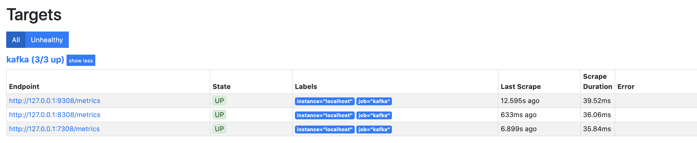
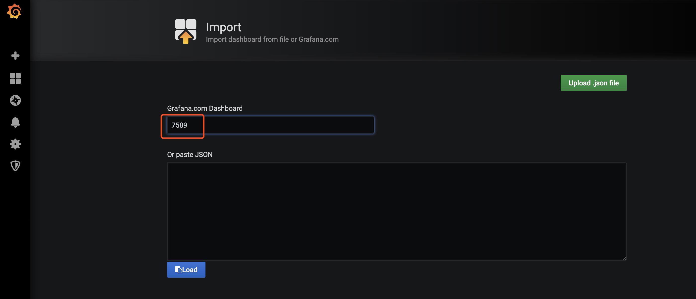
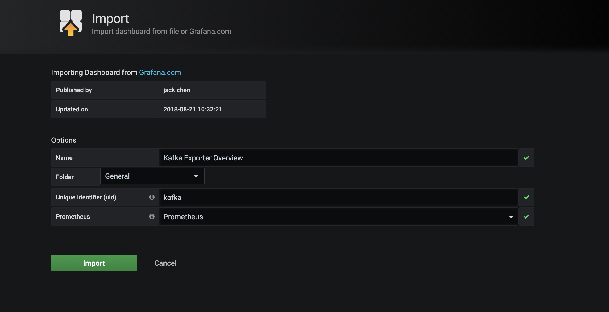
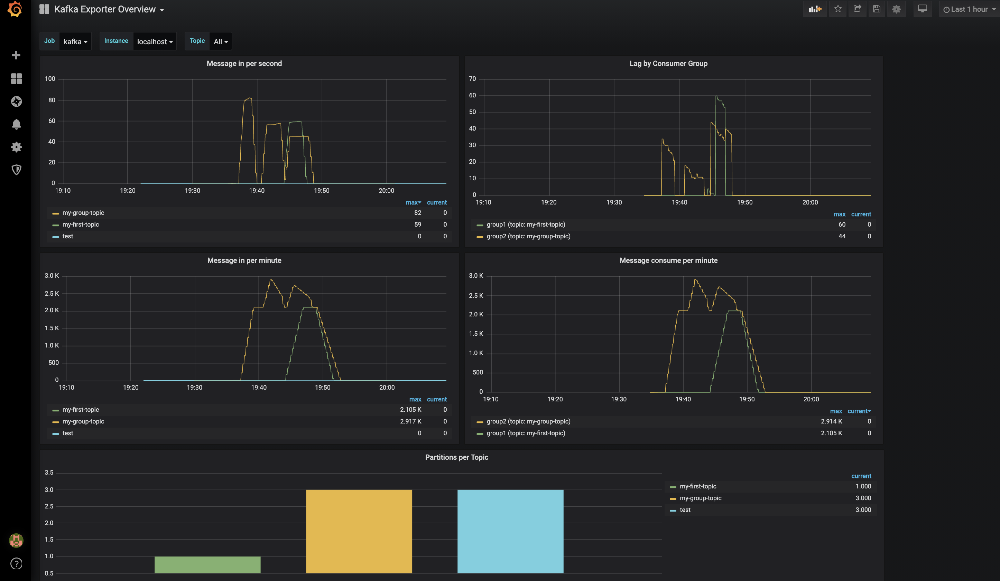

# kafka-demo

### kafka单机

* 启动  
`zookeeper-server-start /usr/local/etc/kafka/zookeeper.properties & kafka-server-start /usr/local/etc/kafka/server.properties`

* 创建主题  
`kafka-topics --create --zookeeper localhost:2181 --replication-factor 1 --partitions 1 --topic my-first-topic`

* 所有topic  
`kafka-topics --list --zookeeper localhost:2181`

* topic详细信息  
`kafka-topics --describe --zookeeper localhost:2181 --topic my-first-topic`

* 创建生产者  
`kafka-console-producer --bootstrap-server localhost:9092 --topic my-first-topic`

* 创建消费者  
`kafka-console-consumer --bootstrap-server localhost:9092 --topic my-first-topic --from-beginning`

----

### kafka集群
复制配置文件server.properties  

|server|server1|server2|
|:----|:----|:----|
|broker.id=0|broker.id=1|broker.id=2|
|log.dirs=/usr/local/var/lib/kafka-logs|log.dirs=/usr/local/var/lib/kafka-logs-1|log.dirs=/usr/local/var/lib/kafka-logs-2|
|num.partitions=3|num.partitions=3|num.partitions=3|
|listeners=PLAINTEXT://:9092|listeners=PLAINTEXT://:9093|listeners=PLAINTEXT://:9094|

* 启动(先启动zookeeper)  
`zookeeper-server-start /usr/local/etc/kafka/zookeeper.properties & kafka-server-start /usr/local/etc/kafka/server.properties & kafka-server-start /usr/local/etc/kafka/server1.properties & kafka-server-start /usr/local/etc/kafka/server2.properties`

* 创建主题  
`kafka-topics --create --zookeeper localhost:2181 --replication-factor 3 --partitions 3 --topic my-group-topic`

----

### Kafka+Prometheus+Grafana 监控
- prometheus.yml添加配置
````yml
  - job_name: 'kafka'
    static_configs:
      - targets: ['127.0.0.1:9308','127.0.0.1:8308','127.0.0.1:7308']
        labels:
          instance: localhost
```` 
- 下载exporter  
`wget https://github.com/danielqsj/kafka_exporter/releases/download/v1.2.0/kafka_exporter-1.2.0.darwin-amd64.tar.gz`   
`tar -zxvf kafka_exporter-1.2.0.darwin-amd64.tar.gz`  

- 启动exporter(先启动kafka)  
`kafka_exporter --kafka.server=localhost:9092 --web.listen-address=":9308" & kafka_exporter --kafka.server=localhost:9093 --web.listen-address=":8308" & kafka_exporter --kafka.server=localhost:9094 --web.listen-address=":7308"`  

- 启动Prometheus  
`prometheus --config.file=prometheus.yml --web.enable-lifecycle`
      

- 启动Grafana  
`brew services start grafana`

- grafana导入kafka监控面板(消费者客户端跑起来监控面板才有数据)  
    [Dashboard](https://grafana.com/grafana/dashboards/7589/revisions)导入流程:

       

     
    
      
    


